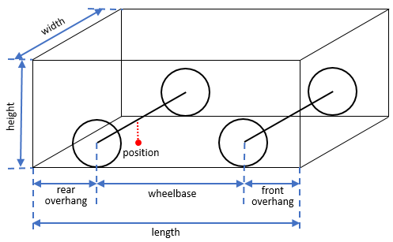

# Updated Hybrid A* Search for AGV Path Planning with Curvature Constraints

## Overview

DESCRIBE PROJECT, SOURCE, ETC

NOTE: initial version roughly implemented the approach from the 2008 paper without respect to curvature, while updates integrated it properly and made strides to update various aspects for efficiency


## Examples

- ADD VISUALIZATIONS AND STUFF HERE
- LINK TO COMPILED LATEX PDF AS DOCS


## Building & Testing (C++ extension)

### Prerequisites

- Python 3.10+
- (Optional) A C++ compiler with C++17 support
  - Linux: `g++` or `clang++`
  - Linux (Debian/Ubuntu): `sudo apt-get install build-essential python3-dev`
  - macOS: Xcode Command Line Tools
  - Windows: "Build Tools for Visual Studio" (MSVC)

### Python-first environment setup

From the repo root (`DolgovMotionPlanner`):

1. Create a virtual environment using Python's `venv`:

```bash
python -m venv .env
```

2. Activate the virtual environment:

a. For Linux users:

```bash
source .env/bin/activate
```

b. For Windows users:

```bash
.env/Scripts/activate
```

3. Finish environment setup and run initial tests with `pytest`:

a. Python only:

```bash
python -m pip install -U pip
pip install -e .
pytest -v
```

b. Optional C++ backend:

```bash
python -m pip install -U pip
pip install -e ".[cpp]"
$env:DOLGOV_BUILD_CPP="1" # on Linux: export DOLGOV_BUILD_CPP="1"
pip install -e . -v
pytest -m cpp
```

### Troubleshooting

- **`ImportError: No module named hybrid_core`**
  - The extension wasn’t built. Re-run `python -m pip install -e .`.

- **Windows/MSVC flag issues**
  - `setup.py` selects MSVC-friendly optimization flags (`/O2`). If your environment still errors, remove `extra_compile_args` temporarily and try again

- **Forcing a rebuild**
  - Delete `build/` and any `*.so`/`*.pyd` artifacts (or reinstall in a fresh virtualenv), then rerun `python -m pip install -e .`.


### Creating new test grids from images of mazes

There exists a test script in `scripts/` that will convert images of mazes to pre-processed `numpy` occupancy grid, as well as the start and goal positions for the maze.

```python
python scripts/npz_from_maze_images.py "path/to/image-directory"
```

By default, the output .npz files are saved to "tests/grids", but the output directory and grid resolution(s) may be specified through additional CLI arguments:

```python
python scripts/npz_from_maze_images.py "path/to/image-directory" --output_dir "path/to/out-directory" --resolutions 50 100 200
```


## Project Parameters

### Simulated Vehicle Parameters

The simulated vehicle model in this project is a simple rectangular offset, most closely following the conventional kinematic "Bicycle" model. Physical dimensions of the vehicle are roughly the same as the modified 2006 Volkswagen Passat used by   in the 2007 DARPA Urban Challenge and examined in their subsequent papers.

The physical vehicle parameters are included as the global constants below. Refer to the diagram below for what they represent. Just as in the diagram, the vehicle pose is taken as the rear-axle center.


| Variable                             |         Math symbol | Meaning                             | Used in                               | Const/Variable | Typical / expected range           |
| ------------------------------------ | ------------------: | ----------------------------------- | ------------------------------------- | -------------- | ---------------------------------- |
| `wheelbase`                          |                 $L$ | wheelbase (rectangle length)        | bicycle model scaling                 | Const          | ~2–3.5 m                           |
| `max_steer`                          |     $\delta_{\max}$ | max steering angle                  | (legacy / informational)              | Const          | ~25°–40°                           |
| `width`                              |                 $W$ | rectangle width                     | collision footprint                   | Const          | ~1.6–2.2 m                         |
| `front_overhang`                     |                   — | axle -> front bumper                | footprint length                      | Const          | ~0.6–1.2 m                         |
| `rear_overhang`                      |                   — | axle -> rear bumper                 | footprint length                      | Const          | ~0.6–1.2 m                         |


## Roadmap

- MENTION SUBPAR C++ INTEGRATION AND PLANS TO UPDATE
- MISC IDEAS FOR IMPROVEMENTS


## Bibliography

```tex
@inproceedings{ dolgov08gppSTAIR,
   paperID   = "STAIR-08",
   month     = "June",
   author    = "Dmitri Dolgov and Sebastian Thrun and Michael Montemerlo and James Diebel",
   booktitle = "Proceedings of the First International Symposium on Search Techniques in Artificial Intelligence and Robotics (STAIR-08)",
   address   = "Chicago, USA",
   title     = "Practical Search Techniques in Path Planning for Autonomous Driving",
   publisher = "AAAI",
   year      = "2008"
}

@article{montemerlo2008junior,
  title={Junior: The stanford entry in the urban challenge},
  author={Montemerlo, Michael and Becker, Jan and Bhat, Suhrid and Dahlkamp, Hendrik and Dolgov, Dmitri and Ettinger, Scott and Haehnel, Dirk and Hilden, Tim and Hoffmann, Gabe and Huhnke, Burkhard and others},
  journal={Journal of field Robotics},
  volume={25},
  number={9},
  pages={569--597},
  year={2008},
  publisher={Wiley Online Library}
}

@article{dolgov2010path,
  title={Path planning for autonomous vehicles in unknown semi-structured environments},
  author={Dolgov, Dmitri and Thrun, Sebastian and Montemerlo, Michael and Diebel, James},
  journal={The international journal of robotics research},
  volume={29},
  number={5},
  pages={485--501},
  year={2010},
  publisher={SAGE Publications Sage UK: London, England}
}
```